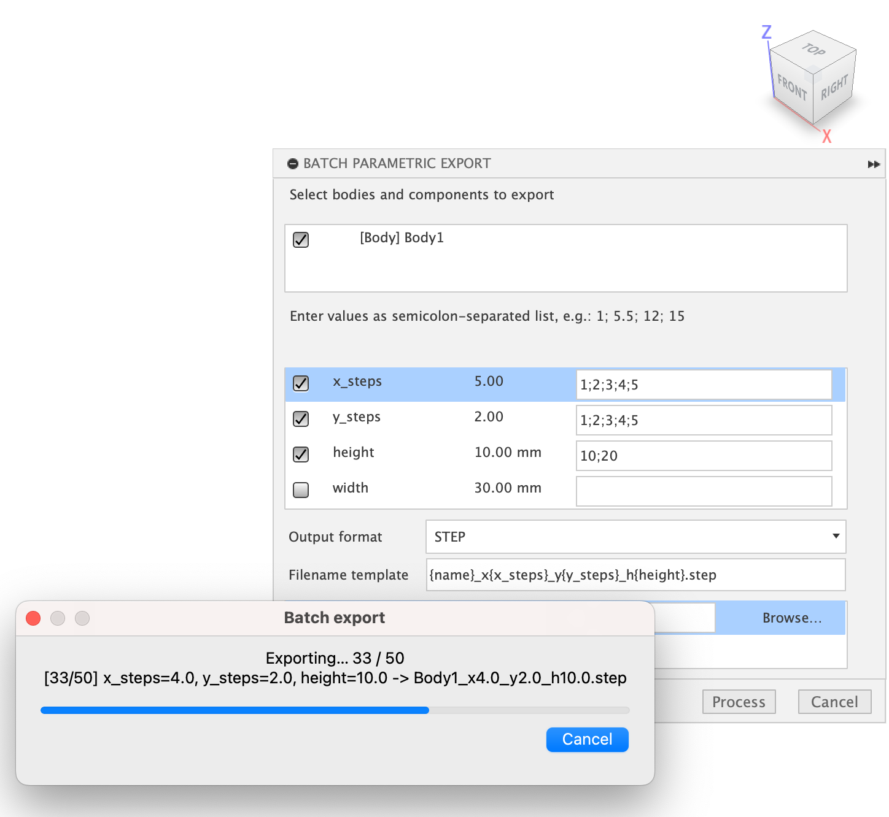

# Batch Parametric export for Autodesk Fusion

This scripts allows to batch export your Fusion design with different parameter combinations. Export possible in mesh formats and STEP.

# Usage

Add the script folder to Fusion, run the script, then:

- select bodies and/or components to export
- select parameters you want to be iterated and provide needed values as semicolon-separated string ("1;2;4.5")
- change filename template as needed
- specify a valid output folder
- sit back and enjoy

# Implementation details

- only non-computable parameters are supported and displayed in the interface (2mm works; 19/param3*3.14 does not)
- absolute path is not required, relative (~/Documents) may fail

# Todo

- add trigger button to Utilities panel
- auto terminate after completin
- better error processing